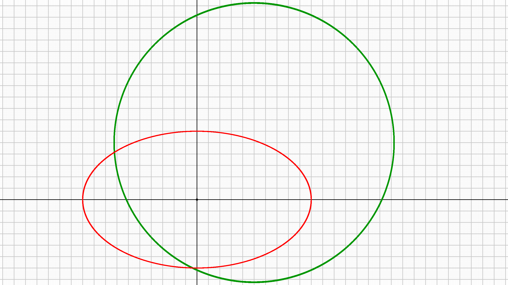

# Graph Maker in C

### Quick Start:

```console
$ make # should be enough lol
$ ./main
```

### Graphic Samples:
- $(x - 5)^2 + (y - 5)^2 = 150$ and $\frac{x^2}{36} + \frac{y^2}{64} = 1$
    
- $y = x^2$  
    
- Basic Grid:
    
- Lines:
    
